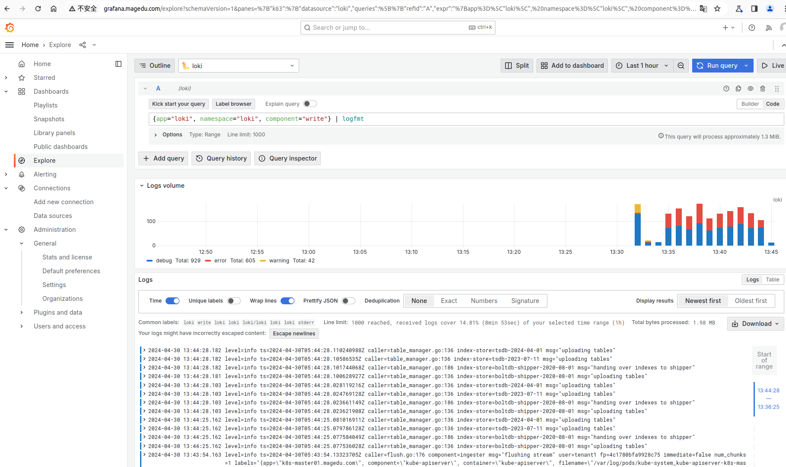

### 部署Grafana


添加相关的Helm仓库garfana，而后更新索引。

```bash
helm repo add grafana https://grafana.github.io/helm-charts
helm repo update
```


使用helm命令，创建grafana release，部署Grafana实例。

```bash
helm upgrade --install --values grafana-values.yaml grafana grafana/grafana --namespace loki --create-namespace
```


前面的部署过程，会自动创建Ingress资源对象Grafana，如下面的命令所示。

```
~# kubectl get ingress grafana -n loki
NAME      CLASS    HOSTS                ADDRESS       PORTS   AGE
grafana   <none>   grafana.magedu.com   172.29.7.51   80      31s
```


请确保将名称“grafana.magedu.com”解析到后面指示的地址上，而后即可通过该主机名访问Grafana。该示例中的部署，默认的用户名和密码是“admin/magedu.com”。


