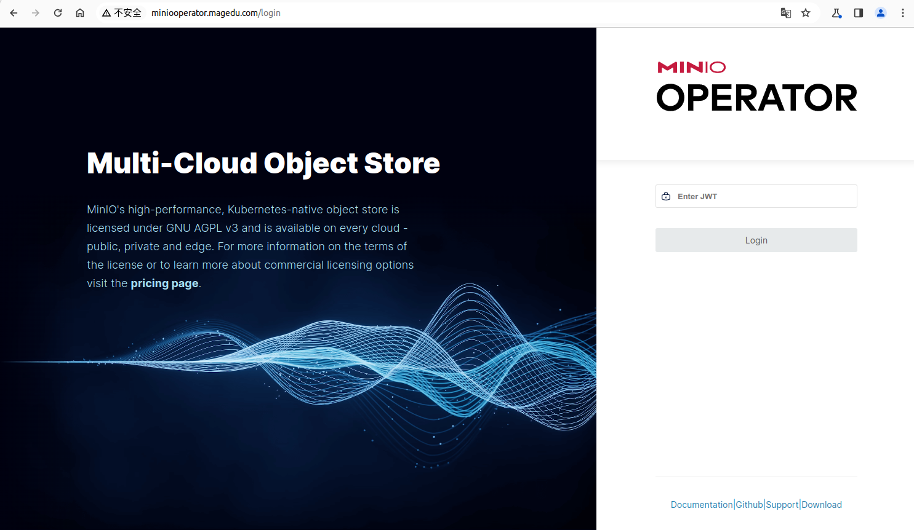
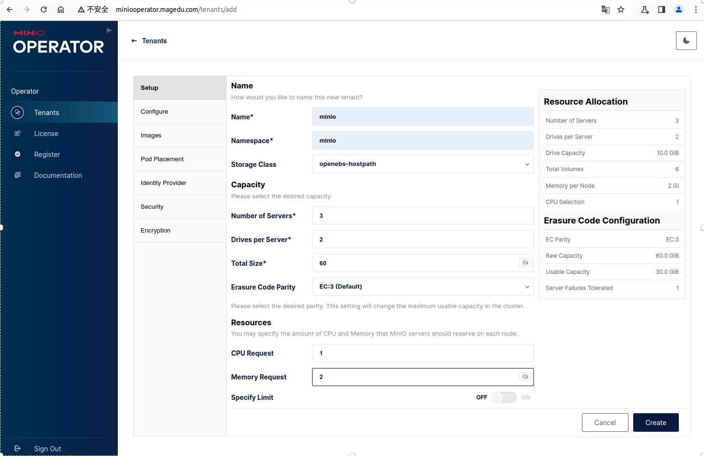
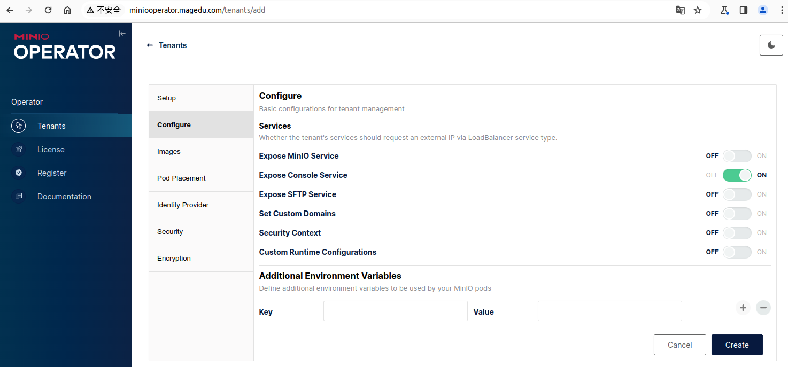
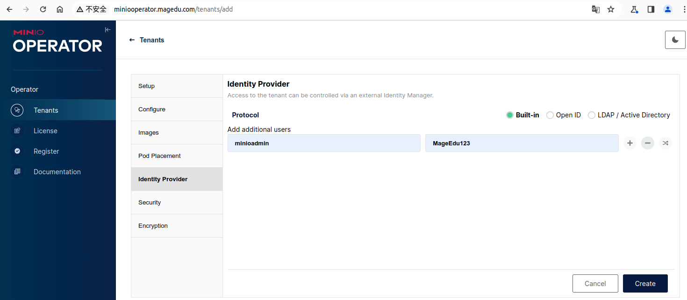
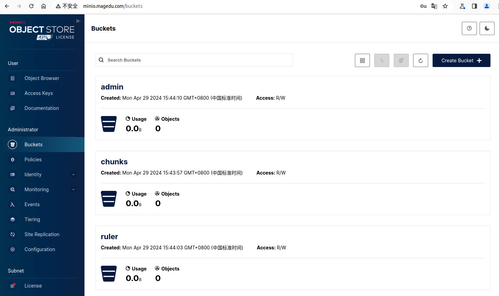

# MinIO Operator

### Install MinIO Operator

添加仓库

```bash
helm repo add minio-operator https://operator.min.io
helm update
```


基于已创建的值文件，创建Release。

```bash
helm upgrade --install --namespace minio-operator --values minio-operator-values.yaml \
             --create-namespace operator minio-operator/operator

kubectl get all -n minio-operator
```


获取Console的JWT，例如Console。

```bash 
kubectl get secret/console-sa-secret -n minio-operator -o json | jq -r ".data.token" | base64 -d ; echo
```





### Create Tenant 

支持图形化创建，helm创建或自定义的tenant CRD资源对象创建。

#### 图开化创建Tenant

第一步，设定主要Tenant的主要参数，包括名称、名称空间、使用的存储类等。




第二步，如果无须将minio暴露到集群外部，可以关闭“Expose MinIO Service”。




第三步，设定登录MinIO的管理员用户及密码。




第四步，如果可以，建议关闭TLS。


最后，确认minio tenant的创建状态。


#### Helm创建Tenant

```bash
helm upgrade --install --namespace minio --values minio-tenant-values.yaml --create-namespace loki minio-operator/tenant
```


#### 基于Tenant CRD创建

```bash
kubectl create namespace minio
kubectl apply -f tenant-example/ -n minio
```


#### 创建Ingress，开放MinIO Console

```
kubectl apply -f minio-ingress.yaml -n minio
```


> 注意：后端部署的Loki Server，会基于“minio.minio.svc.cluster.local”的地址访问MinIO Service，且默认使用的账号和密码是“minioadmin/MageEdu123”。


### 创建Bucket

登录MinIO的控制台，创建Loki依赖到的三个Bucket。

- chunks
- ruler
- admin




