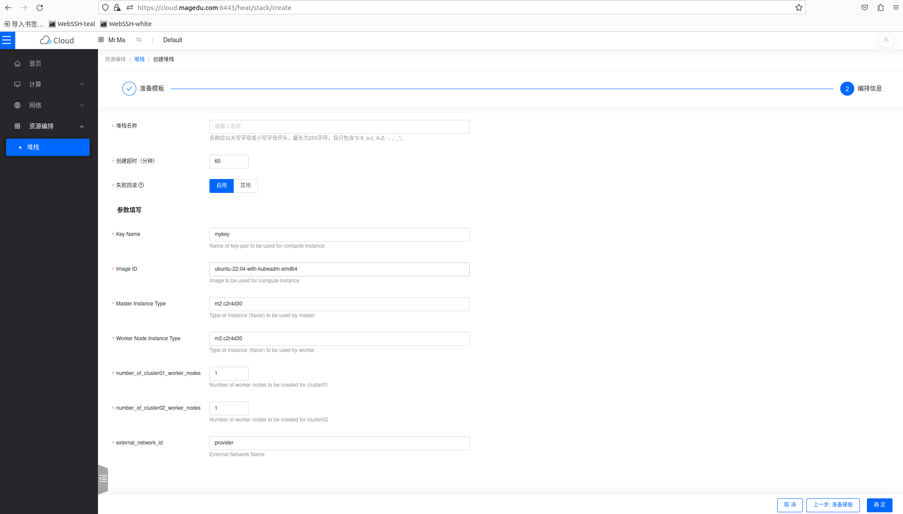

# OpenStack Heat 模板

该目录中的各模板文件，可用于在马哥教育私有云上快速初始化出基础环境，包括网络、子网、FloatingIP、安全组和主机实例等。
- cluster-base-env.tmpl：创建可用于部署Kubernetes集群的三个主机实例，包括一个master和两个worker，且各自都有固定的IP地址；
- cluster_nodes_number_on_damands.tmpl：创建可用于部署Kubernetes集群的主机实例，master节点数量可指定为1-3个，worker节点数量可指定为1-6个；但总体是否能创建成功，还可取决于总体可用的资源量；
- two_clusters.tmpl：创建可用于部署两个Kubernetes集群的主机实例，每个集群中的master固定为1个，而worker节点的数量可分别指定为1-3个；具体的配置过程在通过为参数赋值来完成。

