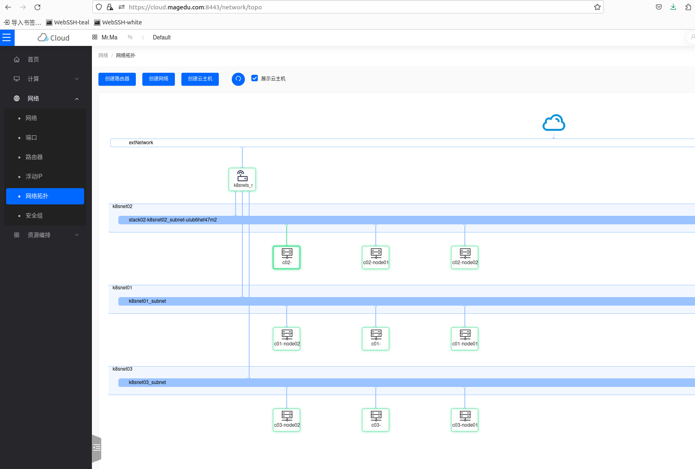

# 快速初始化多Kubernetes集群环境的Heat模板

### 主机环境说明

三个集群各自使用独立的安全组、网络和子网，它们通过同一个路由器彼此互联。

- cluster01.tmpl：集群Cluster01的模板
  - 它会创建c01-master01、c01-node01和c01-node02三个实例
  - 这些主机位于192.168.10.0/24网络中
  - 各实例均有一个浮动IP地址与外部网络交互
- cluster02.tmpl：集群Cluster02的模板
  - 它会创建c02-master01、c02-node01和c02-node02三个实例
  - 它们都位于192.168.20.0/24网络中
  - 各实例均有一个浮动IP地址与外部网络交互
- cluster03.tmpl：集群Cluster03的模板
  - 它会创建c03-master01、c03-node01和c03-node02三个实例
  - 位于192.168.30.0/24网络中
  - 各实例均有一个浮动IP地址与外部网络交互

### 拓扑示意图

