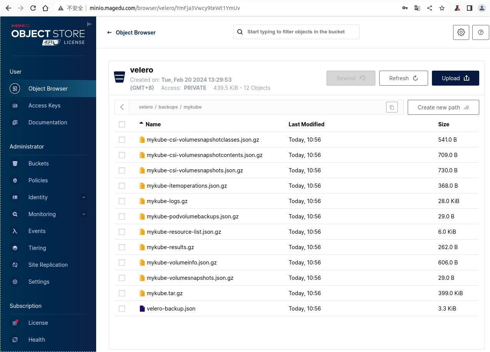
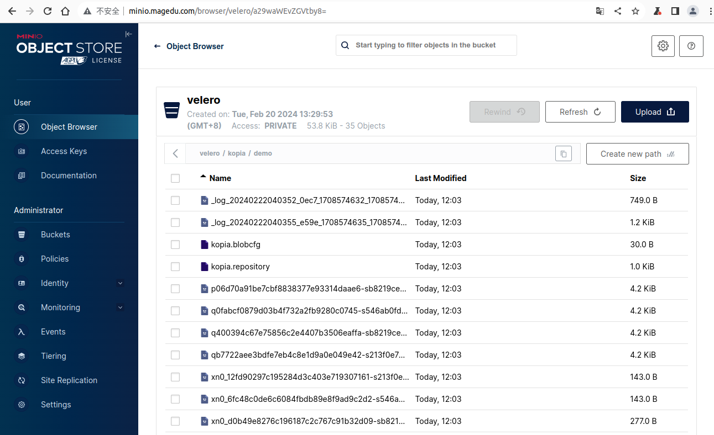

## Velero部署及使用示例

Velero是用于备份和恢复 Kubernetes 集群资源和PV的开源项目。

- 基于Velero CRD创建备份（Backup）和恢复作业（Restore）
- 可以备份或恢复集群中的几乎所有对象，也可以按类型、名称空间或标签过滤对象
- 支持基于文件系统备份（File System Backup，简称FSB）备份Pod卷中的数据，并借助于[restic](https://github.com/restic/restic)或[kopia](https://github.com/kopia/kopia)上传到对象存储系统上
- 支持基于快照备份PV，这种方式较之FSB能确保文件的一致性；它支持两种操作
  - 仅创建PV快照
  - 创建PV快照，并借助于[restic](https://github.com/restic/restic)或[kopia](https://github.com/kopia/kopia)上传到对象存储系统上
- 使用对象存储作为备份数据的存储目标，并基于对象存储上的备份对象完成数据恢复
  - 基于存储提供商插件同各种存储系统集成
  - 支持的Provider列表：https://velero.io/docs/main/supported-providers/

### 部署

Velero会将Backup对象存储于对象存储系统上，例如AWS S3、[Google Cloud Storage](https://github.com/vmware-tanzu/velero-plugin-for-gcp/blob/main/backupstoragelocation.md)、Azure Blob Storage、Alibaba Cloud OSS、Swift等，以及兼容S3接口的第三方对象存储系统，如MinIO等。

本示例将选用本地部署的MinIO，因此，需要事先部署有可用的MinIO（部署于minio名称空间，且服务名同样为minio），且创建了名为velero的bucket。

#### 准备用于认证到MinIO的配置文件

创建名为credentials-velero的文件，用于在部署过程中向velero install命令提供认证到MinIO的认证凭据。

```
[default]
# 访问对象存储系统时使用的用户名
aws_access_key_id = minioadmin
# 用户的密码
aws_secret_access_key = magedu.com
region = minio
```

#### 下载velero CLI

部署velero的常用方法有两种，一是使用velero CLI，另一个则是使用helm。本示例将选用前者进行。

首先，我们需要先下载velero CLI工具程序，以v1.13.0版本例，运行如下命令即可完成下载。

~# curl -LO https://github.com/vmware-tanzu/velero/releases/download/v1.13.0/velero-v1.13.0-linux-amd64.tar.gz

下载完成后，展开压缩文件，将velero复制到PATH环境变量指定的程序搜索目录之一，即可使用velero命令。

~# tar xf velero-v1.13.0-linux-amd64.tar.gz 

~# mv  velero-v1.13.0-linux-amd64/velero  /usr/local/bin/

#### 部署Velero

velero CLI是一个多功能的应用程序，它有着众多的可用子命令。其中的install命令即用于部署Velero至Kubernetes集群上。

> 提示：velero CLI基于kubeconfig文件认证到Kubernetes集群，它搜索和加载kubeconfig的方式与kubectl类似。

```bash
velero install \
    --secret-file=./credentials-velero \
    --provider=aws \
    --bucket=velero \
    --backup-location-config region=minio,s3ForcePathStyle=true,s3Url=http://minio.minio.svc.cluster.local:9000,publicUrl=http://172.29.7.52:9000 \
    --plugins=velero/velero-plugin-for-aws:v1.9.0 \
    --use-volume-snapshots=true \
    --snapshot-location-config region=minio \
    --use-node-agent \
    --uploader-type=kopia
```

上面命令中使用了众多选项，其中各选项的功能如下。

- --provider：用于保存备份和卷数据的Provider的名称；Velero支持多种[Provider](https://velero.io/docs/v1.13/supported-providers/)，不同的Provider通常需要依赖专用的插件
- --plugins：要加载的插件列表，各插件是引用的Image的名称
- --backup-location-config：保存备份的存储系统的具体信息，格式为“key1=value1,key2=value2”
- --snapshot-location-config：保存PV快照的存储系统的具体信息，格式为“key1=value1,key2=value2”
- --use-volume-snapshots：是否自动创建用于保存快照的snapshot location，默认为true
- --secret-file：保存有认证到存储系统的认证凭据的文件
- --bucket：远端对象存储系统上用于保存备份信息的bucket
- --use-node-agent：是否创建用于部署node agent的DaemonSet，它们负责基于Restic或Kopia上传卷和快照中的数据至远端存储系统； 
- --uploader-type：上传数据使用的uploader，可用值为Restic或Kopia

部署完成后，运行如下命令，可以了解到其创建的资源对象。

~# kubectl get all -n velero

如下面命令结果所示，它会部署一个daemonset编排运行Node Agent，以及一个deployment编排运行Velero。

```
NAME                          READY   STATUS    RESTARTS   AGE
pod/node-agent-6r5wb          1/1     Running   0          6m
pod/node-agent-cllqs          1/1     Running   0          6m
pod/node-agent-gm2j6          1/1     Running   0          6m
pod/velero-74b5597d6c-x4rxw   1/1     Running   0          6m

NAME                        DESIRED   CURRENT   READY   UP-TO-DATE   AVAILABLE   NODE SELECTOR   AGE
daemonset.apps/node-agent   3         3         3       3            3           <none>          6m

NAME                     READY   UP-TO-DATE   AVAILABLE   AGE
deployment.apps/velero   1/1     1            1           6m

NAME                                DESIRED   CURRENT   READY   AGE
replicaset.apps/velero-74b5597d6c   1         1         1       6m
```

部署完成后，velero install还会创建多个CRD，这可以通过如下命令了解相关的信息。

~# kubectl api-resources --api-group=velero.io

```
NAME                      SHORTNAMES   APIVERSION           NAMESPACED   KIND
backuprepositories                     velero.io/v1         true         BackupRepository
backups                                velero.io/v1         true         Backup
backupstoragelocations    bsl          velero.io/v1         true         BackupStorageLocation
datadownloads                          velero.io/v2alpha1   true         DataDownload
datauploads                            velero.io/v2alpha1   true         DataUpload
deletebackuprequests                   velero.io/v1         true         DeleteBackupRequest
downloadrequests                       velero.io/v1         true         DownloadRequest
podvolumebackups                       velero.io/v1         true         PodVolumeBackup
podvolumerestores                      velero.io/v1         true         PodVolumeRestore
restores                               velero.io/v1         true         Restore
schedules                              velero.io/v1         true         Schedule
serverstatusrequests      ssr          velero.io/v1         true         ServerStatusRequest
volumesnapshotlocations   vsl          velero.io/v1         true         VolumeSnapshotLocation
```

### 备份（Backup）作业

Velero使用Backup和Restore这两个CRD分别来创建备份和恢复作业。

#### 备份存储位置（Backup Storage Location）

Velero系统上用于保存备份信息的目标位置称为Backup Storage Location，可由专用的CRD/BackupStorageLocation进行定义和维护。Velero部署完成后，它会自动创建一个名为default的Backup Storage Location对象，它代表Velero默认用于存储Backup的位置。

~# kubectl get BackupStorageLocations -n velero

```
NAME      PHASE       LAST VALIDATED   AGE   DEFAULT
default   Available   21s              16m   true
```

也可以使用“velero backup-location”命令了解相关的资源对象，这类的指令式命令通常能够得到更为详细和易于理解的信息。

~# velero backup-location get

```
NAME      PROVIDER   BUCKET/PREFIX   PHASE       LAST VALIDATED                  ACCESS MODE   DEFAULT
default   aws        velero          Available   2024-02-22 10:40:34 +0800 CST   ReadWrite     true
```

用户也可以创建更多的备份存储位置，以便于在不同的备份需求场景中使用，这使用如下格式的命令就能完成。

```
velero backup-location create NAME [flags]
```

命令的具体使用格式，请参考相关的帮助信息进行了解。

#### 创建Backup

通常，为没有使用到Volume的无状态应用创建Backup是最简单的备份需求。

管理Backup对象，可以创建相关的资源配置，并由kubectl进行，也可以由“velero backup”命令直接基于指令式命令完成。命令格式为：

```bash
velero backup create NAME [flags]
```

最为简单的格式就是仅给出Backup名称，如下所示，它将创建名为mykube的Backup对象，备份整个集群，并保存于安装Velero时创建的默认的保存位置，它通常是一个名为default的BackupStorageLocation对象。

```bash
velero backup create mykube
```

而后，可运行如下命令了解相关的Backup信息。未指定具全的Backup时，它将列表所有的Backup对象。

```bash 
velero backup get
```

命令的返回结果如下所示，其中的STATUS字段代表着备份作业的状态，InProgress表示正在进行中，备份执行完成后将转为Completed。

```
NAME     STATUS       ERRORS   WARNINGS   CREATED                         EXPIRES   STORAGE LOCATION   SELECTOR
mykube   InProgress   0        0          2024-02-22 10:56:09 +0800 CST   29d       default            <none>
```

备份生成的内容存储于BackupStorageLocation/default指向的存储位置，本示例中，它指的是我们事先准备的MinIO存储系统上名为velero的bucket中。




若需要打印Backup对象的详细信息，可通过“velero backup describe”命令进行，如下面的命令所示。

```bash 
velero backup describe mykube
```

该命令还支持使用“--details”选项打印更加详细的信息。

删除Backup对象，可通过“velero backup delete”命令进行。例如，若要删除前面创建的Backup/mykube对象，可使用如下命令进行。

```bash
velero backup delete mykube
```

若要一次性删除所有备份对象，使用“velero backup delete --all”命令即可。

#### 定制备份的内容

“velero backup”命令允许用户选定要备份的名称空间，以及要备份的资源类型。

- --include-namespaces：要备份的名称空间列表，默认为“*”，代表备份所有的名称空间；
- --exclude-namespaces：在备份中要排除的名称空间列表，即不要备份的名称空间列表；
- --include-resources：要备份的资源类型列表，格式为“resouce.group”，例如“daemonsets.apps”，默认为“*”；
- --exclude-resources：要排除的资源类型列表，格式为“resouce.group”；
- --include-cluster-resources：同时备份集群级别的所有资源；
- --include-cluster-scoped-resources：要备份的集群级别的资源类型列表；
- --exclude-cluster-scoped-resources：要排除的集群级别的资源类型列表；
- --include-namespace-scoped-resources：要备份的名称空间级别的资源类型列表；不能够同--include-resources、--include-cluster-resources选项同时使用； 
- --exclude-namespace-scoped-resources：要排除的名称空间级别的资源类型列表；
- --snapshot-volumes：是否为PV资源创建快照作为备份作业的一部分，默认为true；
- --default-volumes-to-fs-backup：是否使用FSB机制备份Pod卷中的内容；

注意，上面几个选项中，部分选项不能同时使用，例如--include-resources、--exclude-resources和--include-cluster-resources，就不能同include-cluster-scoped-resources、exclude-cluster-scoped-resources、include-namespace-scoped-resources以及exclude-namespace-scoped-resources几个同时使用。

例如，执行备份测试时，仅备份demo名称空间，可以通过如下命令完成。

```bash
velero backup create backup-demo --include-namespaces demo
```

仅备份demo名称空间，且要使用FSB备份机制来备份Pod Volume中的数据时，可通过如下命令进行。

```bash
velero backup create backup-demo-with-volume --include-namespaces demo --default-volumes-to-fs-backup
```

该命令会触发Velero在远程对象存储的bucket中自动创建一个与uploader同名（默认为kopia）的目录来存储卷中的数据，每个名称空间中的卷数据会存储在一个以名称空间名字命名的目录中。

> 提示：通过这种方式备份Pod卷中的数据，很可能会导致数据不一致的情形。这是因为备份过程是通过复制卷中的数据进行的，这对于一个存在频繁数据写入的Pod卷来说，复制而来的数据不一致也就不难理解了。更为妥当的备份方式，是对PV做快照后，基于快照卷来备份数据。



若要备份除demo以外的所有名称空间，以及集群级别的所有资源，可通过如下命令进行。命令中的“--snapshot-volumes=false”表示不要试图为PV创建快照备份，这在备份的Pod上使用的卷后端不支持快照时较为有用。

```bash 
velero backup create mykube-exclude-demo --include-cluster-resources --snapshot-volumes=false --exclude-namespaces demo
```

另外，"velero backup logs"命令可用于打印Backup对象的详细日志信息，这对于排查错误、验证备份任务细节等特别有帮助。

### 恢复（Restore）作业

Velero的恢复任务由Restore资源对象负责完成。管理Restore资源对象的可用方式类似于Backup，可由kubectl命令基于对象配置文件进行，或者使用“velero restore create”命令完成。本示例仍以后者为例进行说明。

#### 创建和使用Restore

我们通过模拟误删除了demo名称空间，并从备份中执行恢复来了解Velero的灾难恢复机制。下面的命令，能够从前面特地针对demo名称空间创建的备份对象backup-demo中来恢复demo名称空间及内部的所有资源。

```bash 
velero restore create --from-backup backup-demo
```

该命令会创建一个Restore资源对象来执行恢复过程，相关的对象的信息，可由如下命令列出。

```bash 
velero restore get
```

上面创建的恢复对象相关的信息显示如下，相关的对象名称为backup-demo-20240222133038。

```
NAME                         BACKUP        STATUS      STARTED                         COMPLETED                       ERRORS   WARNINGS   CREATED                         SELECTOR
backup-demo-20240222133038   backup-demo   Completed   2024-02-22 13:30:38 +0800 CST   2024-02-22 13:30:39 +0800 CST   0        1          2024-02-22 13:30:38 +0800 CST   <none>
```

若需要打印该Restore对象的详细信息，可使用“velero restore describe”命令进行，而打印日志信息则要使用“velero restore logs”命令完成。

需要注意的是，前一节创建Backup/backup-demo对象时，并未启用FSB机制来上传Pod卷中的数据，因此，对于使用了卷的Pod来说，Restore作业将无法完成其数据恢复，而仅能恢复其卷的定义。而前一节在“velero backup create”命令创建Backup/bacup-demo-with-volume时使用了“--default-volumes-to-fs-backup”选项，它会打包上传各Pod卷中的数据，并可用于数据恢复。

于是，为了测试Pod卷的数据恢复效果，在删除demo名称空间后，我们再次创建一个Restore对象，从带有数据的Backup中进行灾难恢复。

```bash 
velero restore create --from-backup backup-demo-with-volume
```

上面的命令能够恢复Pod卷中的数据至备份那一刻的状态 ，但这种方式备份和恢复的数据，很可能存在不一致状态。

#### 恢复部分数据

“velero restore create”命令还可多个选项，用于帮助用户仅恢复备份集中的部分内容，例如特定的名称空间、特定类型的资源等。

- --include-namespaces：从备份中恢复的名称空间列表，默认为“*”，即备份中存在的所有名称空间；
- --exclude-namespaces：从备份中进行恢复作业时，要排除的名称空间列表；
- --include-resources：从备份中要恢复的资源类型，格式为“resouce.group”，例如“daemonsets.apps”，默认为“*”，即恢复备份集中的所有类型的资源对象；
- --exclude-resources：执行恢复操作时要排除的资源类型；
- -l, --selector：基于标签选择器来指定要恢复的资源对象；
- --namespace-mappings：给恢复的名称空间重命令，格式为“src1:dst1,src2:dst2,...”；
- --restore-volumes：是否要从相关的快照中恢复卷，默认为true；


### 卷快照

Kubernetes集群上部署内置的卷支持快照功能，例如Amazon EBS Volumes、Azure Managed Disks和Google Persistent Disks等，而可通过CSI扩展的很多存储服务也能支持卷快照（Snapshot）功能，对象这些类型的卷的备份，Velero能够自动在其备份任务中请求创建卷快照来作为备份集的一部分，恢复作业也能够自动从卷相关的快照中执行数据恢复操作，这能够帮助用户在灾难恢复场景中，快速将数据恢复到快照创建时刻。而且，Velero还在支持在备份作业创建快照后，将快照中的数据移动到“Volume Snapshot Location”所定义的位置进行保存。

#### 准备支持快照的CSI卷服务

支持卷快照功能的CSI存储服务有很多，例如csi-driver-nfs、csi-driver-host-path和OpenEBS cStor等，本示例将以基于NFS的csi-driver-nfs为例进行说明。首先，在准备好的NFS服务器上，创建exports，导出某个路径（例如/data/nfs）作为存储后端，相关的配置示例如下所示。

```
/data/nfs 172.29.0.0/16(rw,fsid=0,async,no_subtree_check,no_auth_nlm,insecure,no_root_squash)
```

待NFS Server就绪后，在Kubernetes集群上部署[csi-driver-nfs](https://github.com/kubernetes-csi/csi-driver-nfs)项目的某个版本（例如v4.6.0）后，创建StorageClass资源，以前面准备好的NFS服务器为存储后端。

```yaml
apiVersion: storage.k8s.io/v1
kind: StorageClass
metadata:
  name: nfs-csi
parameters:
  # NFS Server服务器的地址
  server: nfs.magedu.com
  share: /data/nfs
provisioner: nfs.csi.k8s.io
reclaimPolicy: Delete
volumeBindingMode: Immediate
```

随后，可基于StorageClass/nfs-csi创建PVC和Pod进行测试，例如下面的资源配置示例。

```bash 
---
kind: PersistentVolumeClaim
apiVersion: v1
metadata:
  name: nfs-pvc
  namespace: demo
spec:
  storageClassName: nfs-csi
  accessModes:
    - ReadWriteMany
  resources:
    requests:
      storage: 5Gi
---
apiVersion: v1
kind: Pod
metadata:
  name: redis-with-nfs-pvc
  namespace: demo
spec:
  containers:
  - name: redis
    image: redis:7-alpine
    ports:
    - containerPort: 6379
      name: redis
    volumeMounts:
    - mountPath: /data
      name: data-storage
  volumes:
  - name: data-storage
    persistentVolumeClaim:
      claimName: nfs-pvc
```

在redis生成数据，并触发持久存储，即可交数据存储于基于CSI的卷上。

#### 验证卷快照的功能

Kubernetes上卷快照的使用要经由几个专用的CRD进行，这些CRD通常在部署CSI存储插件时，会由要关的插件自动部署完成。

```
kubectl api-resources --api-group=snapshot.storage.k8s.io
```

上面的命令应该会返回如下几个资源类型。

```
NAME                     SHORTNAMES          APIVERSION                   NAMESPACED   KIND
volumesnapshotclasses    vsclass,vsclasses   snapshot.storage.k8s.io/v1   false        VolumeSnapshotClass
volumesnapshotcontents   vsc,vscs            snapshot.storage.k8s.io/v1   false        VolumeSnapshotContent
volumesnapshots          vs                  snapshot.storage.k8s.io/v1   true         VolumeSnapshot
```

其中的VolumeSnapshot类似于PVC，通常由用户从VolumeSnapshotClass上请求创建；VolumeSnapshotClass就类似于StorageClass的功能，是创建VolumeSnapshot时使用的模板；VolumeSnapshotContent的功能类似于PV，是负责存储VolumeSnapshot的数据的后端存储设备，可由VolumeSnapshotClass动态置备。

下面定义了一个VolumeSnapshotClass，它是用于支持基于csi-driver-nfs创建卷快照的模板。

```yaml 
apiVersion: snapshot.storage.k8s.io/v1
kind: VolumeSnapshotClass
metadata:
  name: nfs-csi
driver: nfs.csi.k8s.io
parameters:
parameters:
  # 下面的参数与相关CSI插件的StorageClass的参数功能相同
  server: nfs.magedu.com
  share: /data/nfs
deletionPolicy: Delete
```

下面定义了一个VolumeSnapshot，它针对前面创建的PVC/nfs-pvc，从VolumeSnapshotClass/nfs-csi中创建了一个卷快照。

```yaml
apiVersion: snapshot.storage.k8s.io/v1
kind: VolumeSnapshot
metadata:
  name: nfs-pvc-snap
  namespace: demo
spec:
  volumeSnapshotClassName: nfs-csi
  source:
    persistentVolumeClaimName: nfs-pvc
```

运行如下命令，即可打印相关的卷快照的信息。

```bash
kubectl get vs -n demo
```

从如下命令结果中可以看出，相关的数据存储于名为snapcontent-77db3ba8-dfa5-422e-bc18-ea707196a0ec的VolumeSnapshotContent对象上。

```
NAME           READYTOUSE   SOURCEPVC   SOURCESNAPSHOTCONTENT   RESTORESIZE   SNAPSHOTCLASS   SNAPSHOTCONTENT                                    CREATIONTIME   AGE
nfs-pvc-snap   true         nfs-pvc                             353           nfs-csi         snapcontent-77db3ba8-dfa5-422e-bc18-ea707196a0ec   5s             6s
```

VolumeSnapshotContent是集群级别的资源，这类似于PV。如下命令可列出相关的资源对象。

```bash
kubectl get vsc 
```

上面的命令打印的内容如下，这说明相关的存储已然就绪，并可用于卷数据的恢复。

```
NAME                                               READYTOUSE   RESTORESIZE   DELETIONPOLICY   DRIVER           VOLUMESNAPSHOTCLASS   VOLUMESNAPSHOT   VOLUMESNAPSHOTNAMESPACE   AGE
snapcontent-77db3ba8-dfa5-422e-bc18-ea707196a0ec   true         353           Delete           nfs.csi.k8s.io   nfs-csi               nfs-pvc-snap     demo                      50s
```

具体的恢复操作这里不再说明，感兴趣的读者可自行验证。

#### 基于CSI卷快照的备份机制

对于Kubernetes内置的原生支持卷快照的某些卷插件，例如Amazon EBS Volumes、Azure Managed Disks和Google Persistent Disks等，Velero能够在执行备份任务时自动对这类的卷创建快照。而且，Veleror的插件化体系架构，亦可让用户快速构建插件支持自定义的对象存储后端和块存储后端。再或者，如果用户使用的是通过CSI接口扩展出的存储服务，而该插件支持卷快照时，Velero也能统一基于[velero-plugin-for-csi插件](https://github.com/vmware-tanzu/velero-plugin-for-csi/)在备份和恢复时使用CSI卷快照。

Velero FSB备份机制只是对上述快照方法的补充机制，而且也是在Pod上使用了不支持快照的卷时的惟一可用方法。

> 重要提示：CSI卷快照是PV的时间点副本，它比文件系统备份具有更一致的数据。

Velero支持两种基于CSI快照备份Kubernetes资源和卷数据的方式。

- 将Kubernetes资源备份到对象存储并创建PV的CSI快照
- 将Kubernetes资源备份到对象存储并创建PV的CSI快照，然后，再将快照中的数据上传到对象存储系统

Velero要使用CSI卷快照，必须事先部署velero-plugin-for-csi插件，且在部署Velero时启用了CSI特性。下面的命令，附带了部署Velero时启用支持CSI的两个必要配置，“--features=EnableCSI”和“--plugins=velero/velero-plugin-for-csi:v0.7.0”。

```bash
velero install \
    --secret-file=./credentials-velero \
    --provider=aws \
    --bucket=velero \
    --backup-location-config region=minio,s3ForcePathStyle=true,s3Url=http://minio.minio.svc.cluster.local:9000,publicUrl=http://172.29.7.52:9000 \
    --plugins=velero/velero-plugin-for-aws:v1.9.0,velero/velero-plugin-for-csi:v0.7.0 \
    --use-volume-snapshots=true \
    --features=EnableCSI \
    --snapshot-location-config region=minio \
    --use-node-agent \
    --uploader-type=kopia
```

在备份作业中为基于CSI卷的PVC创建快照时，Velero CSI plugin遵循如下逻辑查找要使用的VolumeSnapshotClass资源。

- 配置默认的VolumeSnapshotClass：在默认要使用的VolumeSnapshotClass对象上添加专用的标签“velero.io/csi-volumesnapshot-class”。

  ```yaml
  apiVersion: snapshot.storage.k8s.io/v1
  kind: VolumeSnapshotClass
  metadata:
    name: nfs-csi
    labels:
      # 标签值为布尔型值；
      velero.io/csi-volumesnapshot-class: "true" 
  driver: nfs.csi.k8s.io
  parameters:
  parameters:
    server: nfs.magedu.com
    share: /data/nfs
  deletionPolicy: Delete
  ```

  需要特别说明的是，Kubernetes集群上存在多个VolumeSnapshotClass对象时，仅可为其中的一个配置如上标签。

- 在Backup对象上明确指定要使用的VolumeSnapshotClass：在Backup对象上使用特定格式的注解信息，明确指定要使用的VolumeSnapshotClass。注解要严格遵循“velero.io/csi-volumesnapshot-class_<driver name> = <VolumeSnapshotClass Name>”这一格式。

  ```yaml
  apiVersion: velero.io/v1
  kind: Backup
  metadata:
    name: backup-demo
    annotations:
      # 注解值是为要引用的VolumeSnapshotClass对象的名称
      velero.io/csi-volumesnapshot-class_nfs.csi.k8s.io: "nfs-csi"
  spec:
      includedNamespaces:
      - demo
  ```

  

- 在PVC对象上明确指定要使用的VolumeSnapshotClass：在PVC对象上使用统一格式的注解信息，即可指定要使用VolumeSnapshotClass。注解名称为“velero.io/csi-volumesnapshot-class”，其值为要引用的VolumeSnapshotClass对象的名称。

  ```yaml
  kind: PersistentVolumeClaim
  apiVersion: v1
  metadata:
    name: nfs-pvc
    annotations:
      # 注解值是为要引用的VolumeSnapshotClass对象的名称
      velero.io/csi-volumesnapshot-class: "nfs-csi"
  spec:
    storageClassName: nfs-csi
    accessModes:
      - ReadWriteMany
    resources:
      requests:
        storage: 5Gi
  ```

若相应的VolumeSnapshotClass对象上的回收策略为Delete，则Velero在上传数据完成后，会自动删除创建的VolumeSnapshot和VolumeSnapshotContent对象。

#### CSI卷备份和恢复示例


创建备份，包括自动创建VolumeSnapshot和VolumeSnapshotContent，备份完成后，会删除VolumeSnapshot，但会保留VolumeSnapshotContent。

```bash
velero backup create backup-demo-with-volumesnap --include-namespaces demo
```


```bash
velero backup describe backup-demo-with-volumesnap
```


```
Backup Volumes:
  Velero-Native Snapshots: <none included>

  CSI Snapshots:
    demo/nfs-pvc:
      Snapshot: included, specify --details for more information

  Pod Volume Backups: <none included>
```


```
Backup Volumes:
  Velero-Native Snapshots: <none included>

  CSI Snapshots:
    demo/nfs-pvc:
      Snapshot:
        Operation ID: demo/velero-nfs-pvc-7ssz6/2024-02-22T08:12:50Z
        Snapshot Content Name: snapcontent-136d23ef-404b-443e-b1bc-0cc184071266
        Storage Snapshot ID: 172.29.7.2#data/nfs#snapshot-136d23ef-404b-443e-b1bc-0cc184071266#snapshot-136d23ef-404b-443e-b1bc-0cc184071266#pvc-c14722c1-7a61-47b9-8f64-f661871c3dec
        Snapshot Size (bytes): 280
        CSI Driver: nfs.csi.k8s.io

  Pod Volume Backups: <none included>

```


创建备份，并移动卷快照中的数据至对象存储系统中。备份完成后，会删除创建的VolumeSnapshot和VolumeSnapshotContent。

```bash
velero backup create backup-demo-with-volumesnap-upload --include-namespaces demo --snapshot-move-data
```


```
Backup Volumes:
  Velero-Native Snapshots: <none included>

  CSI Snapshots:
    demo/nfs-pvc:
      Data Movement:
        Operation ID: du-55b2f766-b833-4136-827e-52880370fce4.c14722c1-7a61-47b08f6e7
        Data Mover: velero
        Uploader Type: kopia

  Pod Volume Backups: <none included>
```


没有启用数据上传，本地卷又不支持快照，将无法恢复PVC上的数据。对于不支持快照的卷，可以使用"File System Backup (FSB shortly)"备份机制，这种备份也称为“Pod Volume Backup”，然后再借助于数据移动器（data mover）将数据打包上传到对象存储系统上。


kubectl patch pvc openebs-local-lvm-pvc -p '{"metadata":{"finalizers":null}}' -n demo


csi-driver-nfs 

/exports *(rw,fsid=0,async,no_subtree_check,no_auth_nlm,insecure,no_root_squash)
