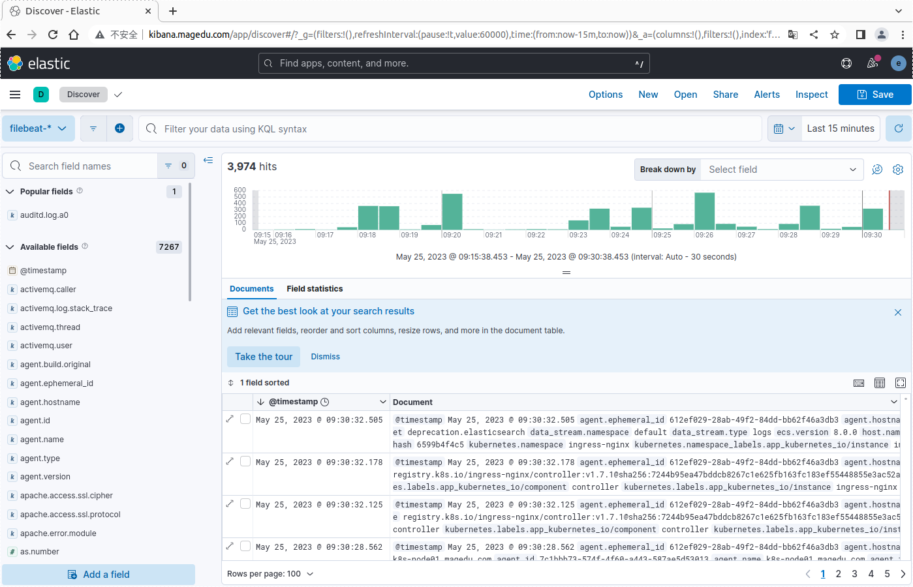

# ECK-Operator

eck-operator是Elastic官方维护的Elastic Stack相关各组件的Operator。

部署文档页面在[这里](https://www.elastic.co/guide/en/cloud-on-k8s/current/k8s-deploy-eck.html)。

## 部署ElasticSearch

提示：部署ElasticSearch的过程依赖于一个可用的默认StorageClass，或者在配置中明确指定要使用的StorageClass。

下面的配置清单定义了一个ElasticSearch集群，版本为8.11.3。

```yaml
apiVersion: elasticsearch.k8s.elastic.co/v1
kind: Elasticsearch
metadata:
  name: myes
spec:
  version: 8.11.3
  nodeSets:
  - name: default
    count: 3
    config:
      node.store.allow_mmap: false
    volumeClaimTemplates:
    - metadata:
        name: elasticsearch-data
      spec:
        accessModes:
        - ReadWriteOnce
        resources:
          requests:
            storage: 20Gi
        storageClassName: nfs-csi
```

访问ElasticSearch，要通过其名字中以集群名称为前缀（例如myes），以“-es-http”后缀的Service进行，例如下面命令结果中的servcies/myes-es-http。

```
kubectl get svc -n elastic-system
```

```
NAME                       TYPE        CLUSTER-IP       EXTERNAL-IP   PORT(S)    AGE
elastic-operator-webhook   ClusterIP   10.101.161.55    <none>        443/TCP    23m 
myes-es-default            ClusterIP   None             <none>        9200/TCP   14m 
myes-es-http               ClusterIP   10.110.174.153   <none>        9200/TCP   14m 
myes-es-internal-http      ClusterIP   10.106.192.197   <none>        9200/TCP   14m 
myes-es-transport          ClusterIP   None             <none>        9300/TCP   14m 
```

我们还要事先获取到访问ElasticSearch的密码，该密码由部署过程自动生成，并保存在了相关名称空间下的Secrets中，该Secrets对象以集群名称为前缀，以“-es-elastic-user”为后缀。下面的命令将获取到的密码保存在名为PASSWORD的变量中。

```
PASSWORD=$(kubectl get secret myes-es-elastic-user -n elastic-system -o go-template='{{.data.elastic | base64decode}}')
```


随后，我们即可在集群上通过类似如下命令访问部署好的ElasticSearch集群。

```
kubectl run client-$RANDOM --image ikubernetes/admin-box:v1.2 -it --rm --restart=Never --command -- /bin/bash
```

```
curl -u "elastic:$PASSWORD" -k https://myes-es-http.elastic-system:9200
```
获取到的ElasticSearch的Banner信息如下。
```
{
  "name" : "myes-es-default-1",
  "cluster_name" : "myes",
  "cluster_uuid" : "gCl81n1HS1q2W-dreAo31Q",
  "version" : {
    "number" : "8.11.3",
    "build_flavor" : "default",
    "build_type" : "docker",
    "build_hash" : "64cf052f3b56b1fd4449f5454cb88aca7e739d9a",
    "build_date" : "2023-12-08T11:33:53.634979452Z",
    "build_snapshot" : false,
    "lucene_version" : "9.8.0",
    "minimum_wire_compatibility_version" : "7.17.0",
    "minimum_index_compatibility_version" : "7.0.0"
  },
  "tagline" : "You Know, for Search"
}
```

## 部署Filebeat

Filebeat相关的[配置文件](./beats-filebeat.yaml)定义了一个Beats资源，它以DaemonSet控制器在每个节点上运行一个filebeat实例，收集日志并保存至ElasticSeach集群中。应用的版本同样为8.11.3。运行如下命令即可将其部署到集群上的elastic-system名称空间下。

```
kubectl apply -f https://raw.githubusercontent.com/iKubernetes/learning-k8s/master/eck-operator/beats-filebeat.yaml
```

待所有Pod就绪、收集日志并发往ElasticSearch之后，在ElasticSearch上即能生成相关的索引。

```
curl -u "elastic:$PASSWORD" -k https://myes-es-http.elastic-system:9200/_cat/indices
```

下面是命令显示的结果，其中的名称形如“.ds-filebeat-8.11.3-2023.05.23-000001”的索引存储的即为filebeat收集的日志信息。

```
green open .fleet-files-agent-000001            6PfhLWE-Rvu8sheE7-nFqw 1 1     0 0   450b   225b 
green open .ds-filebeat-8.11.3-2023.05.23-000001 kLZmXupSRqmJUKzlp8ETCQ 1 1 22549 0 24.4mb 12.3mb 
green open .fleet-file-data-agent-000001        oxPnPWV2T6K5Jpq6IFNFFw 1 1     0 0   450b   225b 
```

## 部署Kibana

本示例中的Kinaba相关的[配置文件](./kibana-myes.yaml)定义了一个Kibana资源，它会创建一个Kibana实例，并关联至前面创建的ElasticSeach集群myes中。Kibana的版本同样为8.11.3。运行如下命令即可完成资源创建。

```
kubectl apply -f https://raw.githubusercontent.com/iKubernetes/learning-k8s/master/eck-operator/kibana-myes.yaml
```

待相关的Pod就绪后，使用ElasticSearch部署时生成的用户elastic及其密码即可登录。密码获取命令如下。

```
PASSWORD=$(kubectl get secret myes-es-elastic-user -n elastic-system -o go-template='{{.data.elastic | base64decode}}')
```

Kibana会自动加载由filebeat生成的index pattern，因此，直接进行Discovery页面即可按需检索数据，如下图所示。


